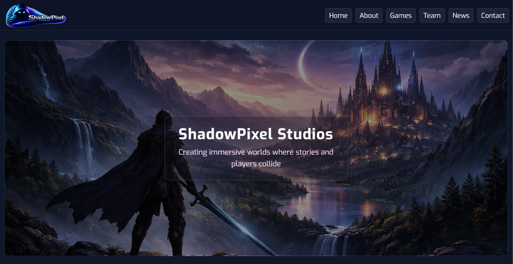
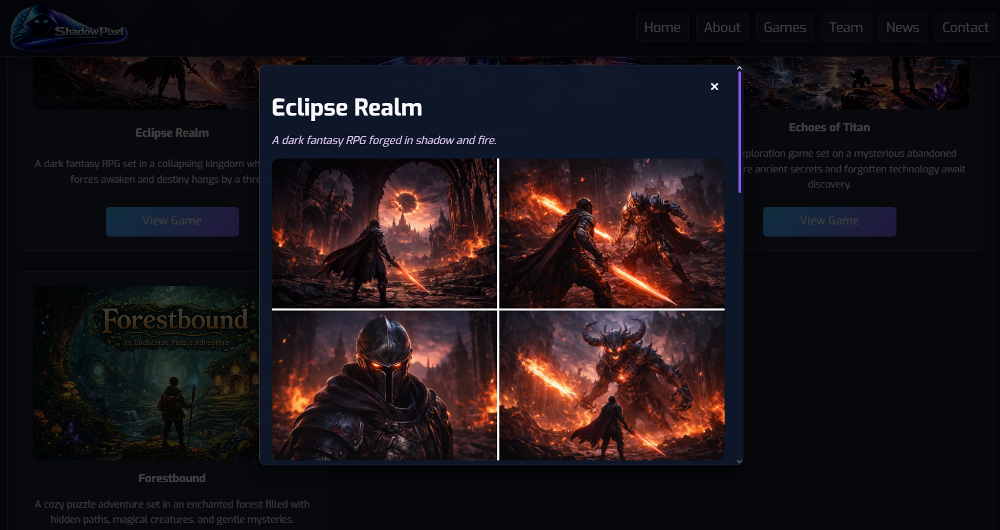

<p align="center">
  
</p>

<h1 align="center">🎮 ShadowPixel Studios</h1>

<p align="center">
A fictional game studio website designed and developed <b>from scratch</b> as a modern front-end portfolio project.
</p>

<p align="center">
  
  
  
  
  
  
  
</p>

<p align="center">
  
  
</p>

<p align="center">
  <a href="https://amirabenameur3.github.io/ShadowPixel_Studios/">
  
  </a>
</p>

---

## 📑 Table of Contents

- [📖 About the Project](#-about-the-project)
- [🌐 Live Demo](#-live-demo)
- [✨ Features](#-features)
- [⚙️ JavaScript Features](#️-javascript-features)
- [🛠 Built With](#-built-with)
- [📸 Screenshots](#-screenshots)
- [📂 Project Structure](#-project-structure)
- [📱 Responsive Design](#-responsive-design)
- [🚀 Deployment](#-deployment)
- [🧠 What I Learned](#-what-i-learned)
- [🚧 Future Improvements](#-future-improvements)
- [👩‍💻 Author](#-author)
- [📌 Disclaimer](#-disclaimer)

---

## 📖 About the Project

**ShadowPixel Studios** is a fictional indie game studio website built as a **front-end portfolio project**.

The goal was to simulate a **real-world production website**, combining design, structure, and interactivity.

The website includes:

- studio presentation
- game showcases
- interactive modals
- news system
- responsive navigation

This project evolved from a static layout into a **fully interactive front-end experience using JavaScript**.

---

## 🌐 Live Demo

You can explore the live version of the website here:

👉 https://amirabenameur3.github.io/ShadowPixel_Studios/

Deployed with **GitHub Pages**

---

## ✨ Features

- 🎮 Hero section with strong visual identity  
- 📖 About / Mission section  
- 🕹 Games showcase with interactive cards  
- 📰 News section linked to game content  
- 👥 Team section  
- 🎨 Modern UI (glassmorphism, gradients, shadows)  
- 📱 Fully responsive layout  
- ⚡ Smooth animations and transitions 

---

## ⚙️ JavaScript Features

This project now includes **custom JavaScript functionality**:

### 📱 Mobile Navigation
- Toggle menu (open/close)
- Click outside to close
- ESC key support
- Dynamic icon switching (☰ / ✖)
- `aria-expanded` accessibility support

### 🪟 Modal System (Core Feature)
- Reusable modal logic for multiple games
- Open/close with buttons
- Close on:
  - outside click
  - ESC key
- Focus management for accessibility
- Prevent background interaction

### 🎯 Scroll Reveal Animation
- Elements animate into view on scroll
- Uses `IntersectionObserver`
- Smooth fade + translate effect

### ♿ Accessibility Enhancements
- Focus trapping inside modals
- Keyboard navigation support
- Semantic roles and ARIA attributes

---

## 🛠 Built With

This project was developed using:

- **HTML5**
- **CSS3**
- **Flexbox & Grid**
- **JavaScript (Vanilla)**
- **Google Fonts**
- **Git & GitHub**
- **GitHub Pages**

---

## 🎬 Demo

<p align="center">
  
</p>

---

## 📸 Screenshots

### Home Page

<p align="center">
  
</p>

### Games Section

<p align="center">
  
</p>

### Modal Section

<p align="center">
  
</p>

### Mobile Layout

<p align="center">
  
</p>

---

## 📂 Project Structure

```
ShadowPixel_Studios
│
├── docs
│   ├── ShadowPixel_Studios_Preview.png
│   ├── demo.gif
│   ├── games.png
│   ├── mission.png
│   ├── mobile.png
│   ├── news.png
│   └── team.png
│
├── resources
│   ├── css
│   │   └── styles.css
│   ├── games
│   ├── images
│   ├── team
│   └── videos
│
├── index.html
├── press-kit.html
├── privacy.html
├── terms.html
├── main.js
├── favicon_shadowpixel.ico
└── README.md
```

---

## 📱 Responsive Design

- Mobile-first improvements
- Flexible layouts (Flexbox & Grid)
- Media queries for breakpoints
- Scalable typography (`clamp`, `rem`)
- Optimized images and spacing

---

## 🚀 Deployment

Deployed using **GitHub Pages**

Steps:

1. Push to GitHub
2. Go to **Settings → Pages**
3. Select branch (`main`)
4. Website is automatically published

---

## 🧠 What I Learned

- Structuring a **real-world front-end project**
- Writing **clean and modular JavaScript**
- Building a **reusable modal system**
- Implementing **accessibility best practices**
- Managing **UI state and interactions**
- Using **Git branches and version control**
- Debugging real UI/UX issues

---

## 🚧 Future Improvements

- Add **dynamic content (API integration)**
- Improve **animations with GSAP or Framer Motion**
- Add **dark/light theme toggle**
- Create a **contact form with validation**
- Enhance **performance optimization**
- Expand into a **React version**

---

## 👩‍💻 Author

**Amira Ben Ameur**  
PhD Researcher in Structural & Transportation Engineering  
Front-End Developer (in progress 🚀)

GitHub:  
https://github.com/amirabenameur3

---

## 📌 Disclaimer

This project represents a **fictional game studio** created for **portfolio and learning purposes only**.

---

## ⭐ If you like the project

Consider giving it a **star on GitHub** ⭐