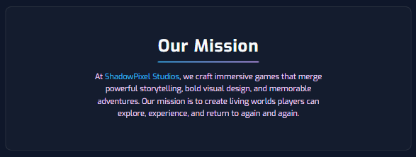
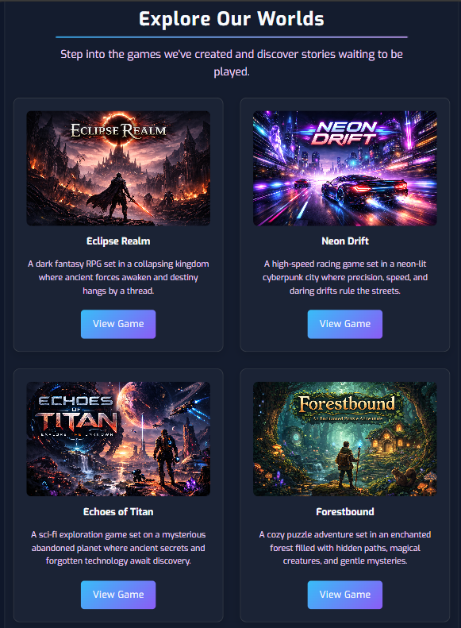
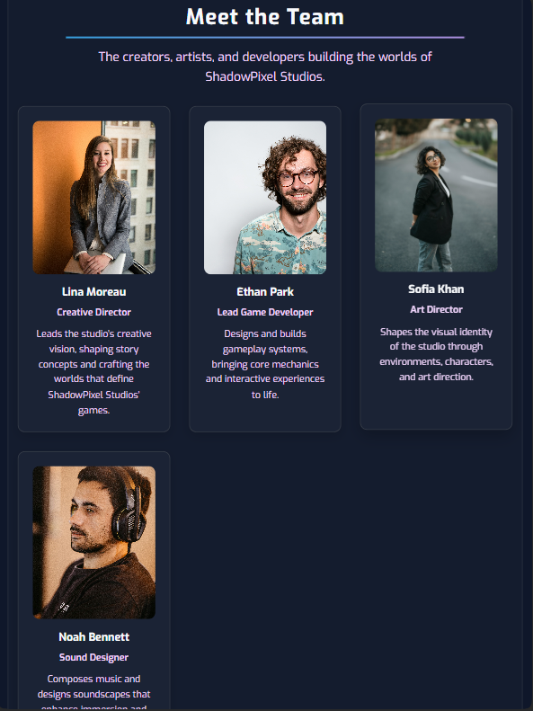
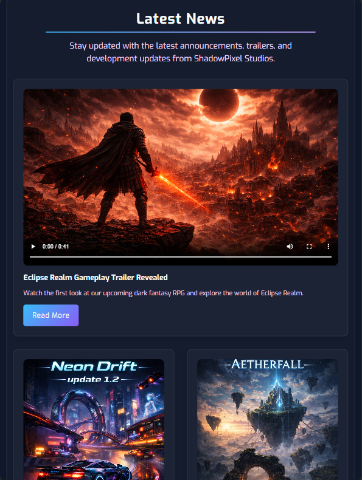
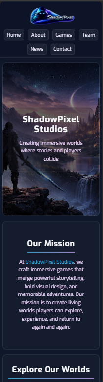

<p align="center">
  
</p>

<h1 align="center">🎮 ShadowPixel Studios</h1>

<p align="center">
A fictional game studio website designed and developed <b>from scratch</b> as a front-end portfolio project.
</p>

<p align="center">
  
  
  
  
  
  
</p>

<p align="center">
  
  
</p>

<p align="center">
  <a href="https://amirabenameur3.github.io/ShadowPixel_Studios/">
  
  </a>
</p>

---

## 📑 Table of Contents

- [📖 About the Project](#-about-the-project)
- [🌐 Live Demo](#-live-demo)
- [✨ Features](#-features)
- [🛠 Built With](#-built-with)
- [📸 Screenshots](#-screenshots)
- [📂 Project Structure](#-project-structure)
- [📱 Responsive Design](#-responsive-design)
- [🚀 Deployment](#-deployment)
- [🧠 What I Learned](#-what-i-learned)
- [🚧 Future Improvements](#-future-improvements)
- [👩‍💻 Author](#-author)
- [📌 Disclaimer](#-disclaimer)

---

## 📖 About the Project

**ShadowPixel Studios** is a fictional indie game studio website created as a **front-end portfolio project**.

The goal of this project was to design and develop a complete website from scratch that simulates the online presence of a game development studio.

The website includes several sections commonly found on studio websites such as:

- studio mission
- featured games
- team members
- news updates

This project focuses on practicing modern **front-end development techniques**, including semantic HTML structure, responsive layouts, and clean project organization.

---

## 🌐 Live Demo

You can explore the live version of the website here:

👉 https://amirabenameur3.github.io/ShadowPixel_Studios/

The website is deployed using **GitHub Pages**.

---

## ✨ Features

- 🎮 **Hero section** introducing the studio
- 📖 **Mission / About section** presenting the studio vision
- 🕹 **Games showcase section**
- 👥 **Team presentation section**
- 📰 **News and updates section**
- 📱 **Responsive design** for multiple screen sizes
- 🎨 Modern styling using **CSS variables**
- ⚡ Lightweight **static website structure**

---

## 🛠 Built With

This project was developed using:

- **HTML5**
- **CSS3**
- **Flexbox**
- **CSS Grid**
- **Responsive Design**
- **Google Fonts**
- **Git**
- **GitHub**

---

## 🎬 Demo

<p align="center">
  
</p>

---

## 📸 Screenshots

### Home Page

<p align="center">
  
</p>

### Mission Section

<p align="center">
  
</p>

### Games Section

<p align="center">
  
</p>

### Team Section

<p align="center">
  
</p>

### News Section

<p align="center">
  
</p>

### Mobile Layout

<p align="center">
  
</p>

---

## 📂 Project Structure

```
PixelShadows_Studios
│
├── docs
│   ├── demo.gif
│   ├── games.png
│   ├── mission.png
│   ├── mobile.png
│   ├── news.png
│   ├── ShadowPixel_Studios.png
│   └── team.png
│
├── resources
│   ├── css
│   │   └── styles.css
│   ├── games
│   ├── images
│   ├── team
│   └── videos
│
├── favicon_shadowpixel.ico
├── index.html
└── README.md
```

---

## 📱 Responsive Design

The website was designed to adapt to different screen sizes using responsive design techniques.

Main strategies used:

- **Flexible layouts** built with Flexbox
- **Relative units** such as `rem`, `%`, and `vw`
- **Media queries** to adjust layout for smaller screens
- Responsive images and scalable typography

The layout automatically adapts for:

- Desktop screens
- Tablets
- Mobile devices

---

## 🚀 Deployment

The project is deployed using **GitHub Pages**.

Steps used to deploy the website:

1. Push the project to a GitHub repository
2. Open the repository **Settings**
3. Navigate to **Pages**
4. Select the deployment branch (usually `main`)
5. GitHub automatically publishes the website

Live website:

https://amirabenameur3.github.io/ShadowPixel_Studios/

---

## 🧠 What I Learned

Through this project I improved my understanding of:

- building a website **entirely from scratch**
- structuring content using **semantic HTML**
- designing layouts with **Flexbox**
- implementing **responsive design techniques**
- organizing a **real-world project folder structure**
- managing version control with **Git and GitHub**
- deploying a website using **GitHub Pages**

---

## 🚧 Future Improvements

Possible future enhancements include:

- adding **JavaScript interactivity**
- implementing a **mobile hamburger navigation menu**
- adding **animations and transitions**
- embedding **game trailers or promotional videos**
- creating a **contact form**
- improving **accessibility and keyboard navigation**

---

## 👩‍💻 Author

**Amira Ben Ameur**

PhD Researcher in Structural & Transportation Engineering  
Front-End Development Enthusiast

GitHub  
https://github.com/amirabenameur3

---

## 📌 Disclaimer

This website represents a **fictional game studio** created for **learning and portfolio purposes**.

It does **not represent a real company or brand**.

---

## ⭐ If you like the project

Consider giving the repository a **star on GitHub** ⭐
